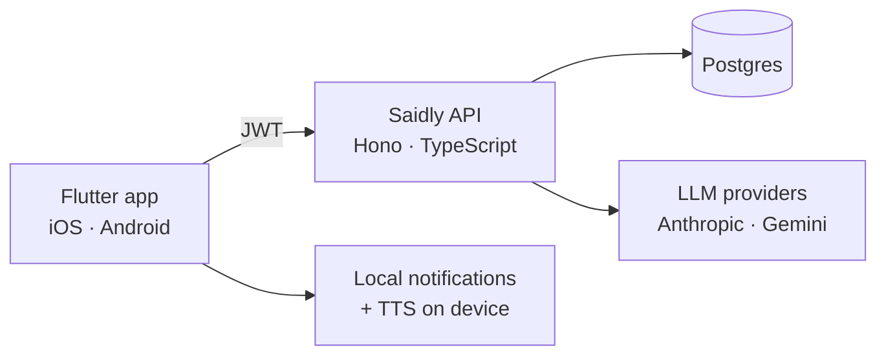

# Saidly

Say tomorrow. Get reminded.

Saidly turns a few sentences about your day — typed tonight, spoken later — into a
structured plan with timed reminders. "Tomorrow wake up at 7, call Marko about the
invoice before noon, harmonica practice from 19:00 to 20:30" becomes three items,
each with a time, and each one nudges you when it matters — as a notification, or
read aloud if sound is on.

> Status: **v0.1 in progress** — text input only, Flutter client + own backend.
> Voice, on-device AI and Siri come in later phases (see roadmap).

## Why

Most task apps make you fill in forms. Planning a day is something people already
do in their head, in full sentences, usually in the evening. Saidly meets that habit
where it is: one text box (later one microphone), one confirmation screen, done.

It is also a deliberately complete product: mobile app, own backend, LLM
integration with cost tracking, evaluation, and later a hybrid on-device/cloud AI
layer. It exists to be used, and to show how such a product is built end-to-end.

## How it works



1. You sign in (Firebase Auth) and type your plan for tomorrow.
2. The app sends the text to `POST /parse`. The API asks an LLM for a strictly
   typed JSON plan (title, start, end, priority), validates it with Zod, stores it
   and records the tokens and cost of the call.
3. You confirm or fix the plan. The app schedules local notifications on the
   device, so reminders fire even offline.
4. At the right moment you get a notification — or a spoken reminder if sound is on.

## Repository layout

```
saidly/
├── apps/
│   ├── api/        Hono + TypeScript + Drizzle + Postgres   (Node 22)
│   └── mobile/     Flutter app                             (Flutter 3.x)
├── eval/           Croatian/English test cases for the parser + runner
├── docs/           Architecture notes, decisions, provider comparison
├── CLAUDE.md       Working rules for AI coding agents
└── README.md
```

## Running locally

**Prerequisites:** Node 22+, pnpm, Docker, Flutter 3.x, a Firebase project (Authentication enabled), an API
key for at least one LLM provider.

```bash
# API
cd apps/api
cp .env.example .env          # fill in DATABASE_URL, FIREBASE_PROJECT_ID, LLM keys
docker compose up -d          # Postgres 16
pnpm install
pnpm db:migrate
pnpm dev                      # http://localhost:3000/health

# Mobile
cd apps/mobile
cp .env.example .env          # API_BASE_URL (Firebase config via flutterfire configure)
flutter pub get
flutter run
```

```bash
# Tests and parser evaluation
cd apps/api
pnpm test                     # Vitest
pnpm eval                     # accuracy, cost and latency per provider
```

## Roadmap

- **v0.1 (Oct 2026)** — text → plan → reminders. API deployed with CI/CD, auth,
  cost tracking, multi-provider parsing, eval set. Flutter client with sign-in,
  plan entry, confirmation, local notifications.
- **v0.2** — voice input, streaming responses, offline cache and sync, spoken
  reminders and a morning "here's your day" summary.
- **v0.3** — on-device parsing on iPhone (Apple Foundation Models + SpeechAnalyzer)
  with cloud fallback; the bridge published as a Flutter package.
- **v0.4** — App Intents ("Hey Siri, Saidly…"), widget, Live Activity, Android
  Gemini Nano where available.
- **v1.0** — App Store and Google Play release with subscriptions.

## Decisions

Short notes on non-obvious choices live in `docs/decisions/`. The first ones:

- Own backend instead of BaaS-only: the LLM gateway (auth, rate limits, cost per
  user, provider switching) is the part clients actually pay for.
- Local notifications instead of push for reminders: they work offline and need no
  server round-trip at the exact minute.
- Text before voice: Croatian relative time expressions and reliable scheduling
  are the hard problems; both can be solved with typed input first.

## License

MIT — see `LICENSE`.
